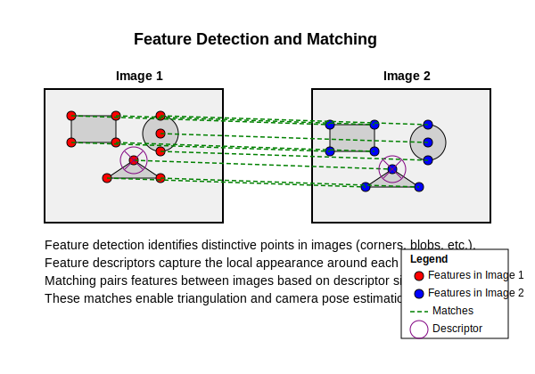
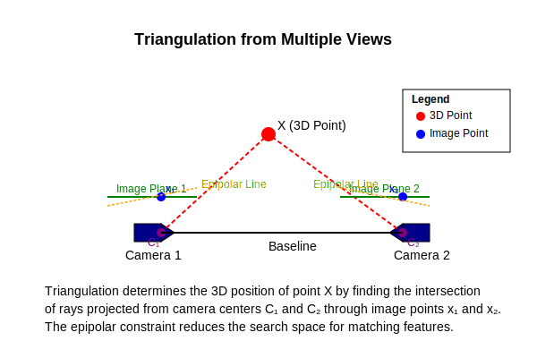
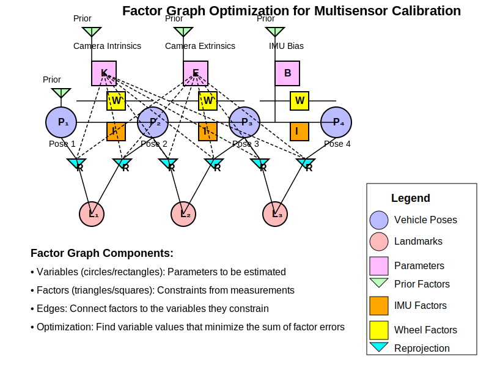

# Technical Design Document (TDD)
## Targetless Multisensor Calibration System for Autonomous Driving

| Document Information |                                |
|----------------------|--------------------------------|
| **Version**          | 1.0                            |
| **Date**             | 2025-04-08                     |
| **Author**           | Gemini                         |
| **Status**           | Draft                          |

## 1. Introduction

This document details the technical design for the offline, targetless multisensor calibration system outlined in PRD multisensor_calib_prd_v1. It covers the system architecture, algorithms, data structures, and implementation choices necessary to meet the specified requirements. The core approach relies on factor graph optimization, integrating visual Structure-from-Motion (SfM) principles with IMU and wheel odometry measurements.

## 2. System Architecture

The system follows a modular pipeline architecture:

### System Components

- **Data Loader & Synchronizer**: Reads various input formats, parses data, and aligns measurements based on timestamps (e.g., using interpolation or nearest-neighbor matching).

- **Initial Ego-Motion Estimator**: Fuses IMU and wheel odometry (e.g., via EKF) to provide an initial estimate of the vehicle's trajectory (poses over time).

- **Visual Initializer / SfM**: Detects/matches features, performs triangulation, and establishes initial 3D landmarks and camera poses relative to the initial ego-motion. Selects keyframes.

- **Factor Graph Builder**: Constructs the optimization problem using a chosen library (GTSAM recommended), defining variables (poses, landmarks, intrinsics, extrinsics, biases) and factors (reprojection, IMU, odometry, priors).

- **Bundle Adjustment Optimizer**: Solves the non-linear least-squares problem defined by the factor graph using an iterative solver (Levenberg-Marquardt).

- **Results Extractor & Validator**: Extracts the final calibrated parameters from the optimized state vector and computes validation metrics.

## 3. Data Management

### Input Formats
Support for common formats like ROS bags (preferred), or sets of CSV/text files and image directories. Parsers will be needed for each supported format.

### Synchronization
Timestamps are critical. Strategy: Resample lower-rate data (e.g., images, wheels) to align with higher-rate data (e.g., IMU) or interpolate high-rate data to match image timestamps. Configurable time tolerance.

### Internal Data Representation
Use Python classes (as defined in the code skeleton) for ImageData, ImuData, WheelEncoderData, CameraIntrinsics, Extrinsics, VehiclePose, Landmark, Feature. Use NumPy arrays for numerical data.

## 4. Core Algorithm Design

### Ego-Motion Estimation

- **State**: EKF state vector to include vehicle pose (position, velocity, orientation as quaternion), IMU biases (gyro, accel).

- **Prediction (IMU)**: Standard IMU state propagation equations, integrating angular velocity and gravity-compensated acceleration.

- **Update (Wheel Odometry)**: Use a suitable vehicle motion model (e.g., differential drive for velocity/yaw rate, or Ackermann if steering angle available) based on wheel speeds. Update step corrects position and yaw.

Where:
- $p_V$: Vehicle position in world frame
- $v_V$: Vehicle velocity in world frame
- $q_{WV}$: Quaternion representing rotation from vehicle to world frame
- $b_g$: Gyroscope bias
- $b_a$: Accelerometer bias
- $a_I$: Measured acceleration in IMU frame
- $\omega_I$: Measured angular velocity in IMU frame
- $g$: Gravity vector in world frame
- $R(q)$: Rotation matrix corresponding to quaternion $q$

### Visual Processing

- **Feature Detector/Descriptor**: ORB (good balance of speed and performance, rotation invariant). Alternative: SIFT (more robust, but patented/slower). Use OpenCV implementation.

- **Matching/Tracking**: Brute-force Hamming distance for ORB descriptors with ratio test. Track features across consecutive frames using KLT tracker (OpenCV calcOpticalFlowPyrLK) or descriptor matching. Match features between overlapping cameras at similar timestamps.

- **Keyframe Selection**: Select keyframes based on time interval, distance traveled, rotation angle, and number of tracked features/matches.

The diagram illustrates the visual processing pipeline, showing how features are detected, described, matched/tracked across frames, and how keyframes are selected based on multiple criteria. The outputs feed into the Structure from Motion (SfM) component.

The above illustration shows how distinctive features are detected in images, described using local descriptors, and matched between frames. These correspondences are essential for triangulation and camera pose estimation.

### Initialization

- **Triangulation**: Linear triangulation (DLT) initially, potentially refined non-linearly. Use matched features between keyframes or cameras with sufficient baseline.

- **Initial Poses/Structure**: Use poses from ego-motion estimate and triangulated points. Potentially run a small, vision-only BA on initial keyframes/landmarks.

The diagram shows the initialization process, starting with ego-motion estimates and feature matches, proceeding through triangulation to create initial 3D landmarks, and optionally performing a vision-only bundle adjustment to refine both camera poses and landmarks before constructing the full factor graph.

The illustration above demonstrates the geometric principle of triangulation. By finding corresponding points in multiple camera views and knowing the camera poses, we can determine the 3D position of a point by finding the intersection of rays projected from the camera centers through the image points. The epipolar constraint helps reduce the search space for matching features.

### Optimization (Factor Graph)

- **Framework**: GTSAM (Georgia Tech Smoothing and Mapping library) - well-suited for factor graph optimization in robotics/vision.

- **Variables**: Pose3 (GTSAM type for SE(3) poses), Point3 (landmarks), Cal3_S2 or Cal3_UNKN (intrinsics), imuBias::ConstantBias (IMU biases).

- **Factors**:
  - **GenericProjectionFactor / SmartProjectionFactor**: For visual reprojection errors. Use robust loss function (e.g., Huber, Cauchy) to handle outliers.
  - **ImuFactor / CombinedImuFactor**: Use GTSAM's preintegration implementation for IMU constraints between poses. Requires IMU noise parameters.
  - **Custom Odometry Factor**: Implement a factor based on the chosen wheel odometry model, constraining relative motion between poses (primarily X, Y, Yaw). Use robust loss.
  - **PriorFactor**: Apply priors on initial pose, initial biases (zero-mean), and potentially on initial intrinsics/extrinsics based on configuration confidence.

- **Solver**: Levenberg-Marquardt (gtsam.LevenbergMarquardtOptimizer). Configure convergence criteria (error tolerance, max iterations).

The diagram illustrates the factor graph optimization structure, showing the variables being estimated (poses, landmarks, intrinsics, extrinsics, biases) and how different types of factors connect these variables. The complete factor graph is then optimized using the Levenberg-Marquardt algorithm to produce the final calibrated parameters.

The illustration above provides a more intuitive representation of the factor graph. Variables (circles and rectangles) represent the parameters we want to estimate, while factors (triangles and squares) represent constraints derived from measurements. The optimization process finds the variable values that minimize the sum of all factor errors, effectively finding the most consistent set of parameters given all available measurements.

### Coordinate Frames

- **Vehicle Frame (V)**: Origin at rear axle center, $X_{fwd}, Y_{left}, Z_{up}$. All extrinsics are defined relative to this frame.
- **IMU Frame (I)**: Sensor's native frame. $\mathbf{T}_{V \leftarrow I}$ is the IMU extrinsic to estimate.
- **Camera Frame (C)**: Sensor's native optical frame ($Z_{fwd}, X_{right}, Y_{down}$). $\mathbf{T}_{V \leftarrow C_i}$ is the extrinsic for camera i.
- **World Frame (W)**: Inertial frame, often aligned with the first vehicle pose. Vehicle poses $\mathbf{T}_{W \leftarrow V_k}$ are estimated during optimization.

The diagram illustrates the relationship between the different coordinate frames in the system. The vehicle frame (V) serves as the reference frame for all extrinsics. The camera (C) and IMU (I) frames are defined relative to the vehicle frame, while the world frame (W) provides the global reference for vehicle poses.

## 5. Key Data Structures (Python Classes)

(Refer to classes defined in the initial Python code skeleton: **TimestampedData, ImageData, ImuData, WheelEncoderData, CameraIntrinsics, Extrinsics, Feature, Match, Landmark, VehiclePose**). Ensure consistent use of NumPy for vector/matrix operations. Use SciPy rotation utilities (scipy.spatial.transform.Rotation) for handling rotations (quaternions, matrices).

## 6. API/Interfaces

- Main pipeline script orchestrates calls to modules.
- Functions within modules should have clear inputs/outputs (as sketched in the Python code).
- Configuration loaded from a file (e.g., YAML) specifying paths, initial guesses, algorithm parameters (feature type, solver settings, noise models).

## 7. Validation & Testing

### Unit Tests
Test individual components (data parsing, synchronization, feature detection, triangulation, EKF steps, factor creation) using pytest. Mock dependencies where necessary.

### Integration Tests
Test interactions between modules (e.g., full initialization pipeline).

### Validation Strategy

- Use datasets with known ground truth (e.g., simulation, VICON/motion capture) if available.
- **Metrics**: Compare estimated parameters to ground truth. Calculate RMS reprojection error on validation data. Visualize alignment of data (e.g., project LiDAR points into calibrated cameras, check consistency of triangulated points).
- **Dataset**: Include diverse scenarios (straight, turns, varying speeds, different lighting).

## 8. Deployment/Execution

- Provide requirements.txt or environment file for dependencies (NumPy, SciPy, OpenCV, GTSAM Python wrapper, PyYAML, etc.).
- Command-line script calibrate.py taking configuration file path as input.
- Clear instructions in README.md on installation and usage.

## 9. Assumptions & Risks

- **Assumption**: Sensor data synchronization is achievable within acceptable tolerance.
  - **Risk**: Poor sync leads to bad calibration.
  - **Mitigation**: Implement robust sync methods, report sync errors.

- **Assumption**: Initial parameter guesses are reasonably close for convergence.
  - **Risk**: Optimization diverges or converges to local minimum.
  - **Mitigation**: Improve initialization steps, allow configuration of solver parameters.

- **Assumption**: Sufficient motion excitation exists in the dataset.
  - **Risk**: Some parameters become unobservable.
  - **Mitigation**: Provide guidelines for data collection, implement checks for observability (e.g., matrix condition number).

- **Assumption**: Rigid mounting of sensors.
  - **Risk**: Non-rigid motion violates model.
  - **Mitigation**: Ensure hardware rigidity.

- **Dependency**: Availability and stability of external libraries (OpenCV, GTSAM).